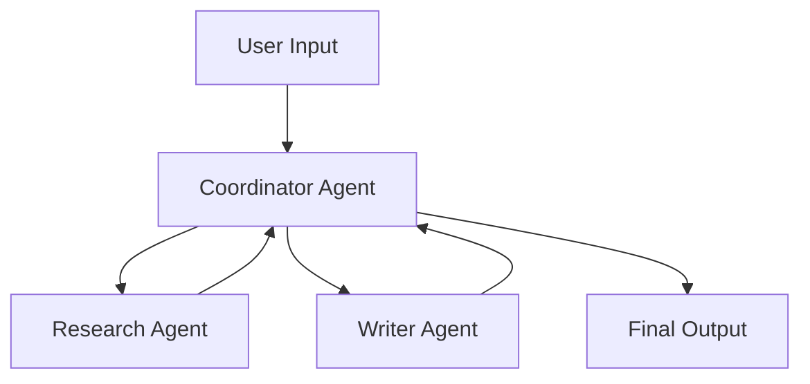

# AutoGen Multi-Agent Application Demo

A comprehensive demonstration of multi-agent collaboration using the AutoGen framework. This project showcases how different AI agents can communicate, coordinate, and collaborate to complete complex tasks.

## 🎯 Project Overview

This application demonstrates three specialized agents working together:

- **🤖 Coordinator Agent**: Manages task flow and coordinates between other agents
- **🔍 Research Agent**: Handles information gathering and analysis tasks  
- **✍️ Writer Agent**: Responsible for content creation and formatting

## 🚀 Features

- **Multi-Agent Communication**: Agents communicate through structured message passing
- **Task Coordination**: Coordinator agent manages task delegation and workflow
- **Specialized Roles**: Each agent has specific capabilities and responsibilities
- **Real-time Collaboration**: Watch agents collaborate in real-time
- **Two Demo Tasks**: Research task and report generation task

## 📋 Requirements

- Python 3.8+
- OpenAI API key
- Internet connection

## 🛠️ Installation

1. **Clone the repository**:
```bash
git clone <repository-url>
cd autogen-multi-agent-demo
```

2. **Create virtual environment**:
```bash
python -m venv venv
source venv/bin/activate  # On Windows: venv\Scripts\activate
```

3. **Install dependencies**:
```bash
pip install -r requirements.txt
```

4. **Configure environment**:
```bash
cp .env.example .env
# Edit .env and add your OpenAI API key
```

## ⚙️ Configuration

### Environment Variables

Create a `.env` file with the following:

```env
OPENAI_API_KEY=your_openai_api_key_here
```

### Agent Configuration

Agents are configured in `config.py` with specific system messages and capabilities:

- **Temperature**: 0.7 (balanced creativity and consistency)
- **Model**: GPT-4 (for best reasoning capabilities)
- **Timeout**: 120 seconds per request

## 🎮 Usage

### Basic Usage

Run the main application:

```bash
python main.py
```

### Available Demonstrations

1. **Research Task**: Agents collaborate to research a topic
2. **Report Task**: Agents work together to create a comprehensive report
3. **Both Tasks**: Complete demonstration of all capabilities

### Example Output

```
╔══════════════════════════════════════════════════════════════╗
║              AutoGen Multi-Agent Application                 ║
║                     Demo Project                             ║
╚══════════════════════════════════════════════════════════════╝

🎮 Available Demonstrations:
1. Research Task - Collaborative information gathering
2. Report Task - Coordinated report generation
3. Both tasks - Complete demonstration

Select demonstration (1/2/3) or press Enter for both:
```

## 🏗️ Project Structure

```
autogen-multi-agent-demo/
├── agents/
│   ├── __init__.py           # Agent exports
│   ├── coordinator.py        # Coordinator agent implementation
│   ├── researcher.py         # Research agent implementation
│   └── writer.py            # Writer agent implementation
├── tasks/
│   ├── __init__.py          # Task exports
│   ├── research_task.py     # Research task implementation
│   └── report_task.py       # Report generation task
├── config.py                # Configuration and settings
├── main.py                  # Main application entry point
├── requirements.txt         # Python dependencies
├── .env.example            # Environment variables template
└── README.md               # This file
```

## 🔧 Customization

### Adding New Agents

1. Create a new agent class in the `agents/` directory
2. Configure the agent in `config.py`
3. Update the `__init__.py` file to export the new agent

### Creating New Tasks

1. Create a new task class in the `tasks/` directory
2. Implement the `execute()` method
3. Add the task to the main application menu

### Modifying Agent Behavior

Edit the system messages in `config.py` to change agent behavior:

```python
AGENT_CONFIG = {
    "your_agent": {
        "name": "your_agent",
        "system_message": "Your custom system message here...",
        "llm_config": LLM_CONFIG,
        "human_input_mode": "NEVER",
    }
}
```

## 🤝 Agent Communication Flow



1. **User** provides task description
2. **Coordinator** analyzes and delegates tasks
3. **Research Agent** gathers information
4. **Writer Agent** creates structured content
5. **Coordinator** coordinates and provides final output

## 🐛 Troubleshooting

### Common Issues

1. **API Key Error**:
   - Ensure your OpenAI API key is correctly set in `.env`
   - Verify the API key has sufficient credits

2. **Module Import Error**:
   - Ensure all dependencies are installed: `pip install -r requirements.txt`
   - Check Python version compatibility (3.8+)

3. **Timeout Issues**:
   - Increase timeout in `config.py`
   - Check internet connection stability

### Debug Mode

Enable verbose logging by modifying the `LLM_CONFIG` in `config.py`:

```python
LLM_CONFIG = {
    "config_list": [...],
    "temperature": 0.7,
    "timeout": 120,
    "seed": 42,  # For reproducible results
}
```

## 📚 Learning Resources

- [AutoGen Documentation](https://microsoft.github.io/autogen/)
- [OpenAI API Documentation](https://platform.openai.com/docs)
- [Multi-Agent Systems](https://en.wikipedia.org/wiki/Multi-agent_system)

## 🤝 Contributing

1. Fork the repository
2. Create a feature branch
3. Make your changes
4. Add tests if applicable
5. Submit a pull request

## 📄 License

This project is licensed under the MIT License - see the LICENSE file for details.

## 🙏 Acknowledgments

- [Microsoft AutoGen Team](https://github.com/microsoft/autogen) for the amazing framework
- [OpenAI](https://openai.com) for providing the language models
- The open-source community for inspiration and best practices

## 📞 Support

If you encounter any issues or have questions:

1. Check the troubleshooting section above
2. Review the [AutoGen documentation](https://microsoft.github.io/autogen/)
3. Open an issue in this repository

---

**Happy Coding! 🚀**